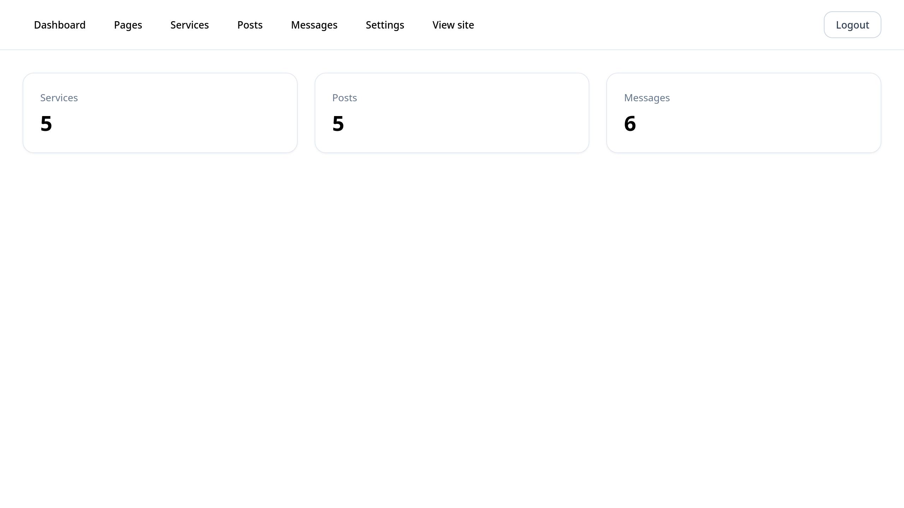
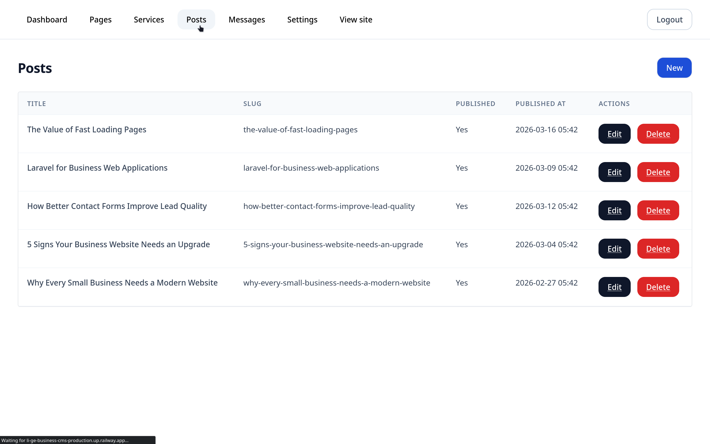
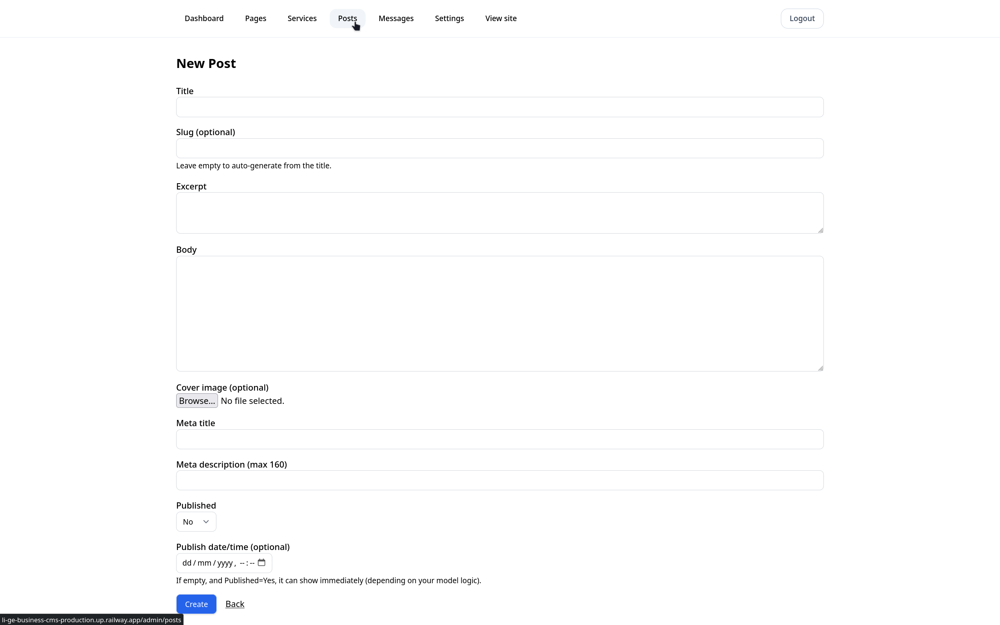
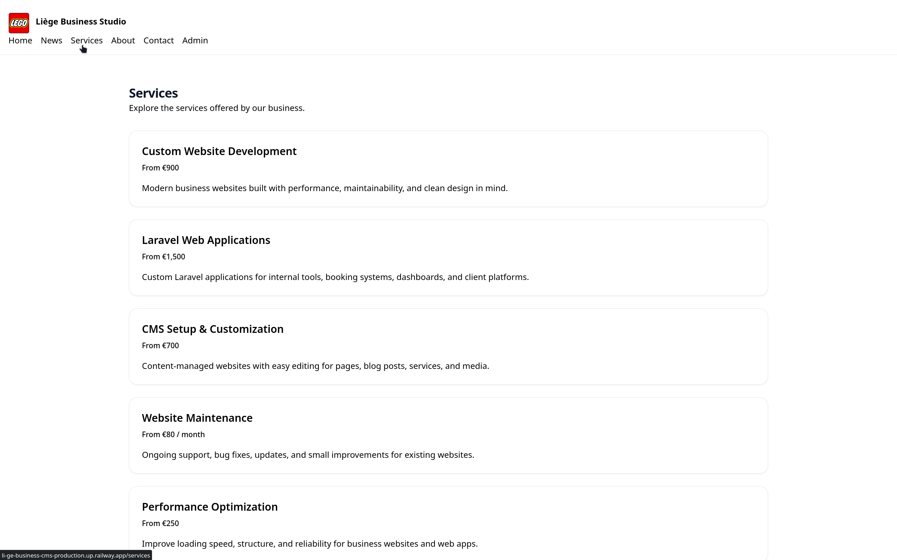

# Liège Business CMS


A production-ready business content management system built with Laravel.

It allows administrators to manage pages, services, blog posts, contact messages, and business settings through a clean dashboard.

This project simulates a real-world CMS used by small businesses.

***

## 🚀 Live Demo

- 🌐 Demo: [https://li-ge-business-cms-production.up.railway.app](https://li-ge-business-cms-production.up.railway.app)
- 🔐 Admin: [https://li-ge-business-cms-production.up.railway.app/admin](https://li-ge-business-cms-production.up.railway.app/admin)

⚠️ **Note:** This is a demo environment. Uploaded images may be reset periodically.

***

## 🔐 Demo Credentials

- **Email:** admin@example.com  
- **Password:** password

***


# ✨ Features

## **Admin Dashboard**
- Secure authentication  
- Admin-only access  
- Clean dashboard overview  

## **Content Management**
- Pages with slug-based routing  
- Services CRUD  
- Blog posts CRUD  
- Publishing system  

## **Media & Storage**
- Image uploads for logo and posts  
- Cloud storage using Cloudflare R2  

## **Contact System**
- Contact form  
- Messages stored in database  
- Email notification support  

## **Settings System**
- Business information management  
- Logo upload  
- Dynamic content configuration  

## **SEO**
- SEO fields for pages and posts  
___


## 🧠 Technical Highlights

- **Built using Laravel MVC architecture**
- **Separation between admin and public areas**
- **Cloud storage integration (Cloudflare R2)**
- **Form validation and error handling**
- **Reusable Blade components**
- **Clean database structure with migrations**
- **Scalable content management approach**

---


## 🖼️ Screenshots

### Admin Dashboard


### Posts Management


### Create/Edit Post


### Public Services Page


***

## Tech Stack

**Backend**
- PHP
- Laravel

**Frontend**
- Blade
- Tailwind CSS

**Database**
- MySQL

**Infrastructure**
- Railway (deployment)
- Cloudflare R2 (object storage)

**Tools**
- Git
- GitHub
- Linux
- Apache

## Installation

```bash
git clone https://github.com/Abdulaib33/Li-ge-Business-CMS.git
cd Li-ge-Business-CMS
composer install
npm install
cp .env.example .env
php artisan key:generate

Configure .env, then:

php artisan migrate --seed
npm run build
php artisan serve
```

*** 

## 👤 Author
Laravel backend developer focused on building real-world web applications, admin systems, and scalable business tools.